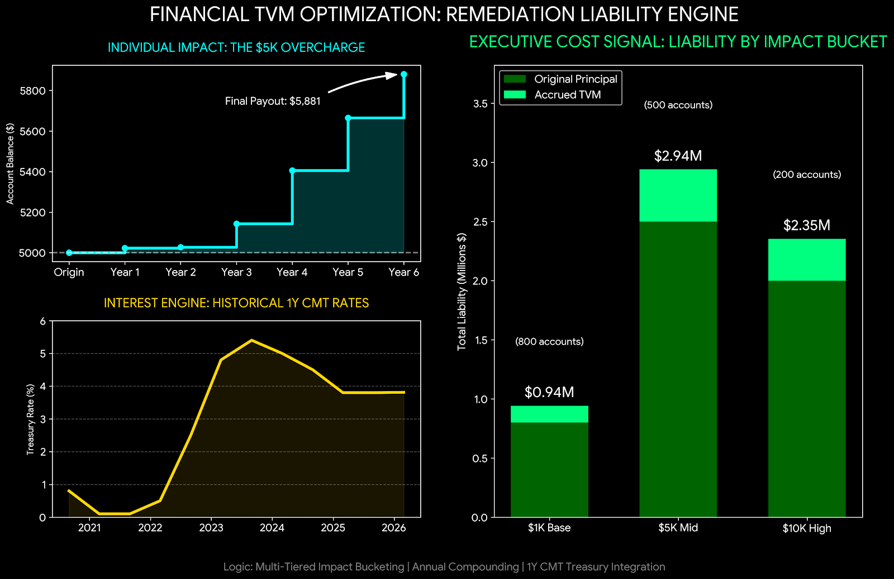

# Financial TVM Optimization: Remediation Liability Engine

## Strategic Intent: Time-Value-of-Money Liability Modeling for Remediation

How do you convert dense account-level remediation inputs into a defensible time-value-of-money cost signal for Finance, Legal, Operations, and executive stakeholders?

This SAS project implements a high-scale time-value-of-money engine for remediation liability calculations. It computes TVM on each account’s financial impact amount from the account-specific impact start date through a defined impact end date, using daily 1-year CMT Treasury rates and annual compounding logic.

The objective is to make account-level financial remediation calculations scalable, explainable, and audit-ready.

This project demonstrates a practical remediation finance principle:

> A remediation liability engine should not only calculate final dollars.  
> It should preserve the logic path from original financial impact, to daily rate exposure, to annual compounding, to final account-level cost signal.

---

## Executive Dashboard

[](./docs/executive_dashboard_preview.png)

[Open dashboard full size](./docs/executive_dashboard_preview.png)

The dashboard translates the SAS TVM engine into an executive view of individual account impact, Treasury-rate sensitivity, and program-level liability concentration.

### Dashboard Interpretation

#### Individual Impact

The top-left panel shows how an original overcharge grows over time as annual compounding is applied. The step-function pattern reflects the anniversary-based compounding design: accumulated daily interest is added at annual boundaries, with final remainder interest added at the impact end date.

#### Interest Engine

The lower-left panel shows the 1-year CMT Treasury rate path used to drive the daily interest calculation. This connects account-level remediation cost to a documented interest-rate environment rather than a static or arbitrary rate assumption.

#### Program Liability Signal

The right-side panel aggregates individual account calculations into impact buckets. It separates original principal from accrued TVM so leadership can see where total remediation liability is concentrated.

---

## TVM Calculation Framework

### Core Inputs

The engine expects two primary SAS input tables.

#### 1. Starting Population

```sas
work.starting_population
```

Required conceptual fields:

| Field | Purpose |
|---|---|
| `account_id` | Account identifier |
| `impact_start_date` | Date when the financial impact begins |
| `financial_amount` | Original account-level impact amount |

#### 2. Treasury Rate Table

```sas
work.treasury_1yr_cmt_rates
```

Required conceptual fields:

| Field | Purpose |
|---|---|
| `treasury_dt` | Daily Treasury rate date |
| `treasury_rate` | 1-year CMT Treasury rate |

The code expects holiday and weekend gaps to be backfilled to the closest prior available rate before the TVM process runs.

### Impact End Date

The script defines an impact end date as:

```text
today + 90 days
```

and stores it in the macro variable:

```sas
&IMPACT_END_DATE
```

This can be adjusted depending on the remediation or analysis window.

### Daily Interest

Daily interest is calculated using:

```text
daily_rate = treasury_rate / 365
daily_interest = current_financial_amount × daily_rate
```

The engine stores daily interest at the row level and uses it for annual and final-remainder compounding.

### Annual Compounding

On each account’s annual anniversary from `impact_start_date`, the engine sums the prior 365 days of daily interest and adds that amount to the account balance.

Conceptual flow:

```text
original financial amount
→ daily interest accumulation
→ annual anniversary sum
→ compounded balance update
```

### Final Remainder Interest

At the final `IMPACT_END_DATE`, the engine sums daily interest from the most recent anniversary through the final impact date and adds that remainder interest to the account balance.

This produces:

```sas
financial_amount_plus_tvm
```

which represents:

```text
original financial amount + accrued TVM
```

---

## Processing Architecture

Primary source file:

[`src/high_scale_tvm_engine.sas`](./src/high_scale_tvm_engine.sas)

### 1. Impact-Date Setup

The script first creates the macro variable `&IMPACT_END_DATE`.

```sas
IMPACT_END_DATE = INTNX('DAY', TODAY(), +90);
```

This establishes the ending point for all account-level TVM calculations.

### 2. Population Chunking

Large account populations are split into manageable processing chunks.

Configurable controls:

```sas
%let split = 200000;
%let per_array_loop = 5000;
```

| Macro Variable | Purpose |
|---|---|
| `split` | Number of accounts per split dataset |
| `per_array_loop` | Number of accounts processed in each FCMP loop iteration |

This design reduces memory pressure and gives the user control over batch size based on available SAS server resources.

### 3. Treasury-Date Filtering

The engine finds the earliest `impact_start_date` in the starting population and filters Treasury rates between:

```text
earliest impact start date
and
IMPACT_END_DATE
```

This avoids unnecessary rate joins outside the needed calculation window.

### 4. Array-Ready Input Construction

For each account chunk, the engine joins account records to daily Treasury rates and builds an array-ready dataset.

The array input contains helper fields such as:

| Field | Purpose |
|---|---|
| `place_indicator` | Marks first, middle, and last rows for each account |
| `account_id_ct` | Running day count for the account |
| `anniversary` | Flags exact annual boundaries |
| `daily_rate` | Daily Treasury rate |
| `financial_amount` | Current balance basis |
| `daily_int` | Daily interest placeholder |
| `int_summed` | Annual / remainder interest placeholder |
| `last_days` | Number of days since the last anniversary |

### 5. PROC FCMP Array Processing

The core calculation runs through `PROC FCMP`.

The FCMP routine reads each batch into a two-dimensional array, processes account-level interest logic in memory, and writes updated values back to the temporary dataset.

Conceptual array columns:

| Array Column | Meaning |
|---|---|
| `col1` | daily rate |
| `col2` | financial amount / compounded amount |
| `col3` | place indicator |
| `col4` | account day counter |
| `col5` | account id |
| `col6` | anniversary flag |
| `col7` | daily interest |
| `col8` | summed interest |
| `col9` | last-days remainder count |

### 6. Final Account-Level Extraction

After FCMP processing, the engine keeps the last observation for each account and outputs:

```sas
financial_amount_plus_tvm
```

The provided implementation creates chunk-level completed outputs such as:

```sas
work.tvm_array_complete1
```

If the chunk processing loop is expanded, additional chunk-complete outputs can be produced and combined.

---

## Main Macro Components

### `%split_dataset`

Purpose:

```text
Split the starting population into account chunks and create array-ready TVM input tables.
```

Key responsibilities:

- determine chunk boundaries
- join account records to Treasury rates
- calculate daily rate
- create account day counters
- flag annual anniversaries
- calculate `last_days` for final remainder compounding

### `%array_input`

Nested within `%split_dataset`.

Purpose:

```text
Build the detailed account × Treasury-rate input table for one chunk.
```

This macro creates `work.tvm_array&b`, the account-level daily-rate dataset used by the FCMP calculation.

### `%process`

Purpose:

```text
Process one chunk through PROC FCMP in account batches.
```

Key responsibilities:

- select a batch of accounts
- load the batch into a two-dimensional FCMP array
- calculate daily interest
- apply annual compounding
- apply final remainder compounding
- extract the final row per account

### `%run_process`

Purpose:

```text
Driver macro for running chunk-level TVM processing.
```

The current version processes the first chunk by default and can be extended to process additional chunks in sequence.

---

## Executive Interpretation

### Anniversary-Based Precision

The engine applies TVM at annual boundaries rather than using a single flat interest uplift. This makes the result more explainable for long remediation windows where interest accrual timing matters.

### Treasury-Linked Cost Signal

By using daily 1-year CMT Treasury rates, the calculation connects remediation liability to an external rate path. This creates a stronger financial rationale than static-rate assumptions.

### Scalable Processing Design

The chunking and FCMP array design is built for large account populations where naive row-by-row processing can become inefficient or memory constrained.

### Finance-Ready Output

The final account-level result can be used as the basis for downstream liability summaries, executive dashboards, remediation cost forecasts, or payment calculation review.

### No Cold Handoffs

The dashboard and code comments are designed to make the calculation path understandable to both technical owners and executive stakeholders.

---

## Technical Architecture

### SAS-First Implementation

This project is implemented in SAS and designed for high-volume remediation environments where account-level financial calculations, auditability, and batch execution matter.

### Main SAS Techniques

The engine uses:

- SAS macro variables
- dataset chunking
- `PROC MEANS`
- `PROC SQL`
- `DATA` step processing
- `BY` group logic
- `PROC SORT`
- `PROC DATASETS`
- `PROC FCMP`
- two-dimensional arrays
- in-memory account-level processing
- annual anniversary flags
- final remainder compounding

### Performance Design

The architecture is designed to reduce memory pressure by:

- limiting each join to a chunk of accounts
- restricting Treasury dates to the needed window
- using array-ready datasets
- processing account batches through FCMP loops
- deleting intermediate datasets after each chunk

### Auditability

The code documents the purpose of each major step:

```text
impact end-date setup
population chunking
Treasury-rate filtering
array input construction
anniversary logic
remainder-day logic
FCMP processing
final account-level extraction
```

This makes the calculation easier to explain, review, and validate.

---

## Repository Contents

```text
financial-tvm-optimization/
│
├── README.md
│
├── docs/
│   └── executive_dashboard_preview.png
│
└── src/
    └── high_scale_tvm_engine.sas
```

### Core Artifacts

| Artifact | Purpose |
|---|---|
| [`docs/executive_dashboard_preview.png`](./docs/executive_dashboard_preview.png) | Executive dashboard preview |
| [`src/high_scale_tvm_engine.sas`](./src/high_scale_tvm_engine.sas) | High-scale SAS TVM calculation engine |

---

## How to Run

### 1. Prepare the Treasury Rate Table

Create or load:

```sas
work.treasury_1yr_cmt_rates
```

Expected conceptual fields:

```sas
treasury_dt
treasury_rate
```

Holiday and weekend rate gaps should be backfilled to the closest prior available rate before running the TVM process.

### 2. Prepare the Starting Population

Create or load:

```sas
work.starting_population
```

Expected conceptual fields:

```sas
account_id
impact_start_date
financial_amount
```

### 3. Review Macro Controls

Adjust the processing controls if needed:

```sas
%let split = 200000;
%let per_array_loop = 5000;
```

These should be tuned based on account volume and available SAS server memory.

### 4. Run the SAS Script

Run:

```text
src/high_scale_tvm_engine.sas
```

### 5. Review Final Output

For the provided default run path, review:

```sas
work.tvm_array_complete1
```

Key field:

```sas
financial_amount_plus_tvm
```

If the chunk-processing driver is expanded, review and combine additional `work.tvm_array_complete&b` outputs as needed.

---

## Supported Boundaries

This project is a remediation finance demonstration engine, not a production disbursement system.

Important boundaries:

- The input Treasury rate table must be prepared before the engine runs.
- Holiday and weekend backfilling is expected to be handled upstream or during Treasury-rate preparation.
- The default `IMPACT_END_DATE` is `today + 90 days` and should be adjusted to the governed remediation context.
- The provided driver macro processes one chunk by default; it can be expanded for additional chunks.
- The final output is an account-level TVM-adjusted balance, not a full payment authorization workflow.
- Treasury-rate assumptions, compounding rules, and payout logic must be governed by the applicable business, legal, finance, and compliance stakeholders before production use.

---

## Data Privacy and Interpretation Boundaries

All data and visual outputs in this repository are generated from synthetic or anonymized datasets to protect proprietary information.

This framework demonstrates methodology for high-stakes enterprise and regulatory environments, but it does not expose real customer data, proprietary remediation calculations, confidential financial rules, or regulated production pipelines.

Important interpretation boundaries:

- Dashboard values are demonstration values, not production remediation totals.
- The engine calculates account-level TVM-adjusted balances, not final customer communications or disbursement instructions.
- Treasury-rate inputs must be independently sourced, validated, and governed in any production setting.
- The calculation framework should be reviewed by Finance, Legal, Compliance, Operations, and Audit before any production use.

---

## Portfolio Philosophy

**No Cold Handoffs** — engineering zero-defect, audit-ready results so stakeholders internalize the underlying “why.”

This project is designed to ensure that time-value-of-money remediation logic is not treated as a black-box calculation. The goal is to make the full path from original financial amount, to daily rate exposure, to annual compounding, to final liability signal clear enough for technical, finance, legal, operations, and executive stakeholders to review and defend.
